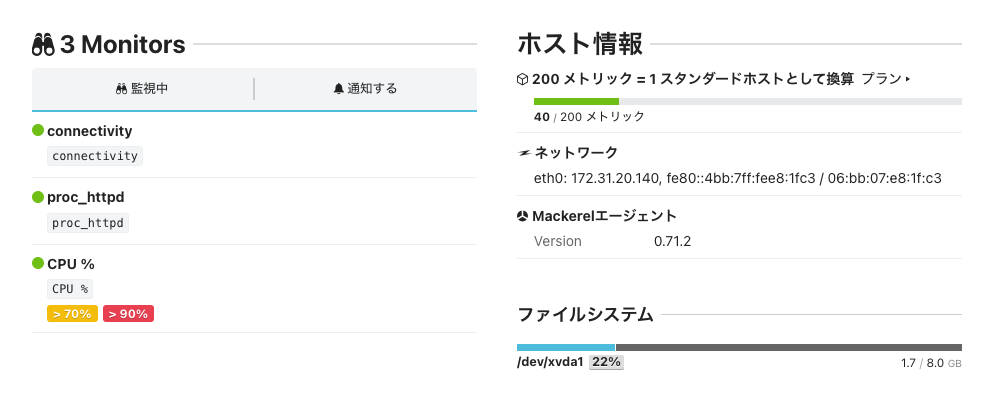

# 公式チェックプラグインを導入する

公式チェックプラグインをインストールしてサーバーの状態を監視してみましょう。

## 公式プラグインをインストールする

監視対象サーバーで以下のコマンドを実行し、公式チェックプラグインをインストールします。

```shell
sudo yum install -y mackerel-check-plugins
```

完了したら、インストールされたプラグインを見てましょう。

```shell
ls -l /usr/bin/check-*
```

30近いプラグインがインストールされていることを確認していただけるかと思います！

チェックプラグインもGitHubリポジトリにてソースコードを公開しています。

- [https://github.com/mackerelio/go-check-plugins/](https://github.com/mackerelio/go-check-plugins/)

それではプロセス監視を行う`check-procs`をセットアップしてみましょう。

## プロセス監視をしてみる

インストールされたプラグインのうち check-procs プラグインでプロセス監視をしてみます。

現時点でホスト上ではシステムを構成する役割となるようなプログラムが動いていないため、httpd (Apache) をインストールしてWebサーバーとしてプロセス監視を設定してみます。

以下のコマンドでhttpdをインストールして特に設定などはせずにそのまま起動します。

```shell
sudo yum install httpd
sudo systemctl start httpd
```

念のため`ps`コマンドでhttpdプロセスが実行されていることを確認してください。

```shell
ps aux | grep httpd
root      3918  0.6  0.9 255220  9296 ?        Ss   03:52   0:00 /usr/sbin/httpd -DFOREGROUND
apache    3919  0.0  0.6 306576  6308 ?        Sl   03:52   0:00 /usr/sbin/httpd -DFOREGROUND
apache    3920  0.0  0.6 306576  6308 ?        Sl   03:52   0:00 /usr/sbin/httpd -DFOREGROUND
apache    3921  0.0  0.6 306576  6308 ?        Sl   03:52   0:00 /usr/sbin/httpd -DFOREGROUND
apache    3922  0.0  0.6 536016  6308 ?        Sl   03:52   0:00 /usr/sbin/httpd -DFOREGROUND
apache    3923  0.0  0.6 306576  6308 ?        Sl   03:52   0:00 /usr/sbin/httpd -DFOREGROUND
ec2-user  3967  0.0  0.0 119436   936 pts/0    S+   03:52   0:00 grep --color=auto httpd
```

mackerel-agentの設定ファイル `/etc/mackerel-agent/mackerel-agent.conf` に設定を2行追記します。

以下のコマンドをターミナルで実行することで追記できます。

```shell
sudo sh << SCRIPT
cat >>/etc/mackerel-agent/mackerel-agent.conf <<'EOF';

[plugin.checks.proc_httpd]
command = ["check-procs", "--pattern", "httpd"]
EOF
SCRIPT
```

viなどのエディタで開いて以下の2行を追記しても構いません。

```toml
[plugin.checks.proc_httpd]
command = ["check-procs", "--pattern", "httpd"]
```


特にエラーなどが発生せず、再びコマンドが入力できる状態になっていれば成功です。（完了メッセージも表示されません）

確認して問題なければ、設定内容のシンタックスチェックを行い mackerel-agent を再起動します。

```shell
mackerel-agent configtest
sudo systemctl restart mackerel-agent
```

コマンド実行後、`[ OK ]`と表示されていれば起動成功です。

## プラグインを手動で実行してみる

以下のコマンドにより実行してみて、どのような結果が得られるか確認してみましょう。

```shell
check-procs --pattern httpd
```

以下のような結果が表示されればプラグインが正常に実行され、結果の1行目に`Procs OK`とある様にプロセスが正常に稼働している事が確認できます。

```shell
Procs OK:
Found 6 matching processes; cmd /httpd/
```

チェックプラグインはコマンドを実行した終了ステータスで監視結果を表現します。check-procsコマンドを実行した直後に次のように終了ステータスを確認すると`0`となっていることがわかります。

```shell
echo $?
```

以下の仕様に沿ってプラグインを実装することで、チェック監視項目を強化できます。

- [チェックプラグイン仕様（チェック監視項目を追加する） - Mackerel ヘルプ](https://mackerel.io/ja/docs/entry/custom-checks#plugin)

それでは設定を反映したホストの詳細画面の上部／下部にある Monitors にチェック監視とその結果が反映されているか確認してみましょう。[ホスト](https://mackerel.io/my/hosts)からアクセスします。



Monitors に`proc_httpd`が追加されていることが確認できます。（スクリーンショットは画面下部）

## 監視対象プロセスを停止してみる

監視しているhttpdプロセスを停止してアラートの発報を確認してみましょう。

```shell
sudo systemctl stop httpd
```

アラートが発報される前に手動でプラグインを実行して監視結果がどの様に変化するか確認してみます。

```shell
check-procs --pattern httpd
```

以下のように`Procs CRITICAL`と1行目が`OK`から`CRITICAL`に変わっていることが確認できます。

```shell
Procs CRITICAL:
Found 0 matching processes; cmd /httpd/
```

発報されたアラートを[アラート](https://mackerel.io/my/alerts)から確認してみます。


アラートが確認できたら障害から復旧させてみましょう。

```shell
sudo systemctl start httpd
```

httpdプロセスを起動して数分するとアラートが自動的にクローズされることを確認します。
