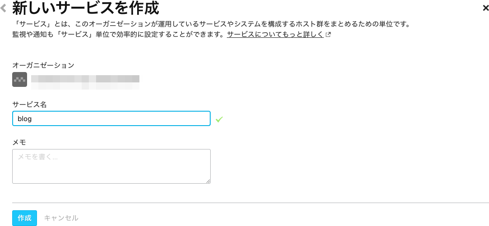
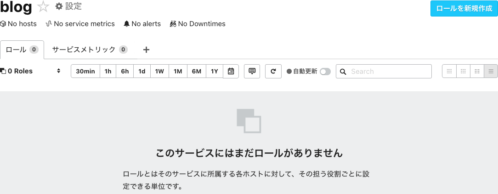
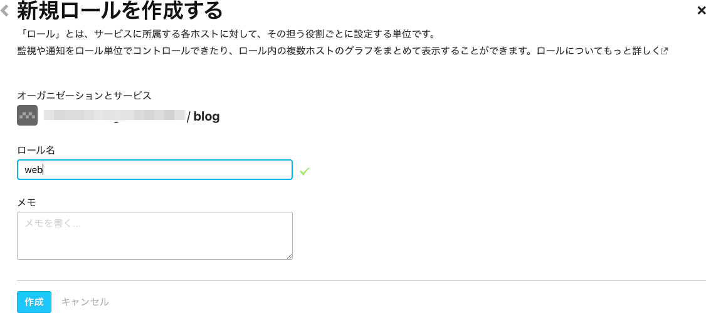
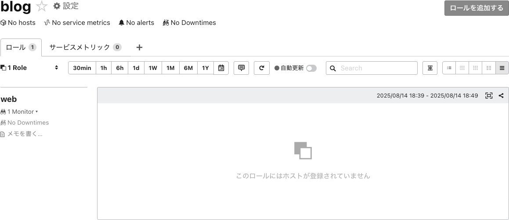
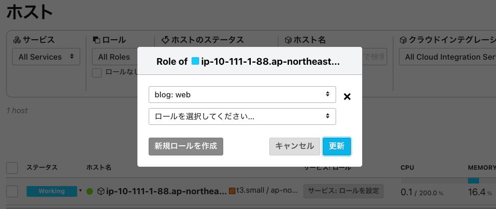
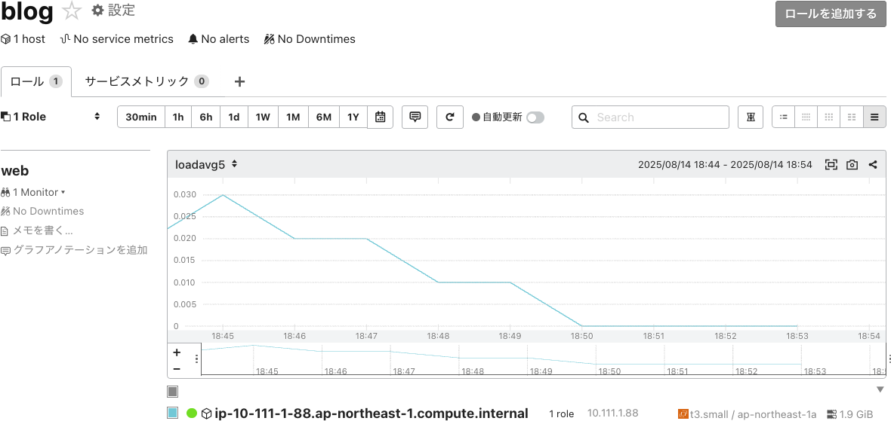

# サービス／ロールでホスト管理をする

Mackerelではホスト1台1台を管理・監視するのではなく、適切な単位でグルーピングをする「サービス」と「ロール」という概念で効率的にホストを管理・監視する方法を提供しています。

- [「サービス」「ロール」とは - Mackerel ヘルプ](https://mackerel.io/ja/docs/entry/spec/about-service-role)

このハンズオンでは新たに登録されたホストを「サービス」と「ロール」に所属させてみましょう。

## サービス／ロールを作成する

左サイドメニューの[サービス](https://mackerel.io/my/services)にアクセスして、`サービスを新規作成`から新規サービスを追加しましょう。


任意のサービス名を指定してサービスを作成します。（ここでは`blog`というサービスにします。）


続いて作成したサービスを開き、`ロールを新規作成`から新規ロールを追加します。


任意のロール名を指定してロールを作成します。（ここでは`web`というロールにします。）


これで`blog`サービスに`web`ロールが作成されました。

以下のように`web`ロールのグラフが表示されていることが確認できますが、この時点ではロールにホストが紐付いていない状態のため空表示となります。


## ホストとサービス／ロールを紐付ける

左サイドメニューの[ホスト](https://mackerel.io/my/hosts)を開き、先ほど追加したホストを作成したサービス／ロールに所属させます。
`サービス: ロールを設定`から作成したサービス／ロールを選択します。



これでサービス／ロールにホストが追加されました。少し時間をおいてロールグラフを確認してみます。

## 設定ファイルでサービス／ロールの作成と紐付けを行う

設定ファイル `/etc/mackerel-agent/mackerel-agent.conf` に設定を追記することで、ホストをサービス／ロールに紐付けることもできます。

以下のコマンドをターミナルで実行することで追記できます。

```shell
sudo sh << SCRIPT
cat >>/etc/mackerel-agent/mackerel-agent.conf <<'EOF';

roles = ["blog:web"]
EOF
SCRIPT
```

特にエラーなどが発生せず、再びコマンドが入力できる状態になっていれば成功です。（完了メッセージなどは表示されません）

viなどのエディタで開いて以下の行を追記しても構いません。

```toml
roles = ["blog:web"]
```

mackerel-agent.conf を変更した際に有効なシンタックスチェック機能がmackerel-agentには備わっています。次のコマンドを実行してみましょう。

```shell
mackerel-agent configtest
```

次のような結果が出力されていれば記載ミスなどがないことを確認できます。

```
SUCCESS (/etc/mackerel-agent/mackerel-agent.conf)
```

問題なければ、以下のコマンドにより mackerel-agent を再起動します。

```shell
sudo systemctl restart mackerel-agent
```

systemctl コマンドで mackerel-agent が起動していることを確認しましょう。

```shell
systemctl status mackerel-agent
```

## ロールグラフを確認する

[サービス](https://mackerel.io/my/services)から再びロールグラフを表示してみます。



ホストが追加され、ロールグラフが表示されていることが確認できましたね。

- 前: [エージェントをインストールする](../02_install_agent/readme.md)
- 次: [監視ルールを追加する](../04_monitors/readme.md)
