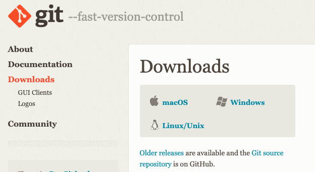
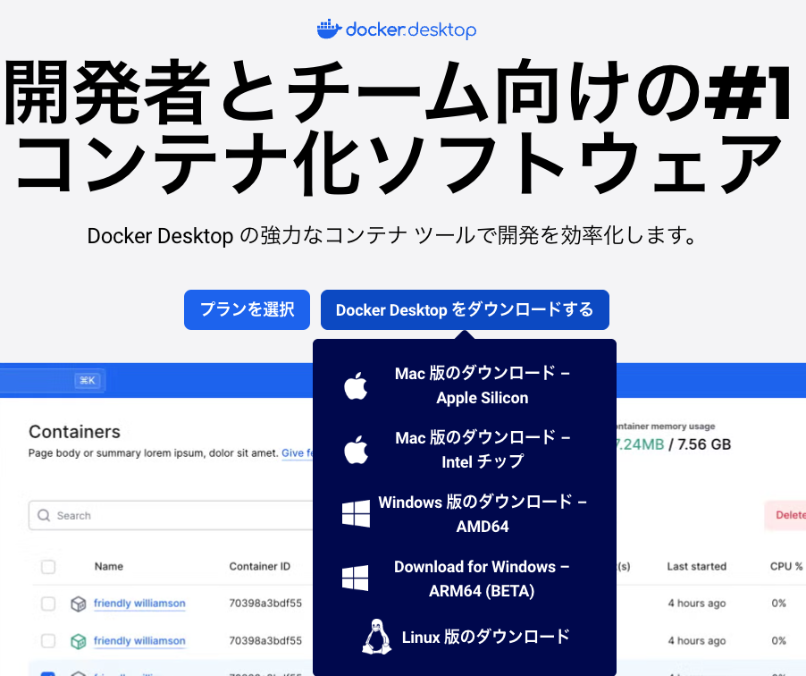

[←目次へ戻る](../README.md)

# このハンズオンを始める前の準備

ようこそ！ このハンズオンでは、皆さんのコンピュータ上に構築した仮想環境コンテナでアプリケーションを動かし、アプリケーションから得られたOpenTelemetryトレースシグナルをオブザーバビリティプラットフォームの[Mackerel](https://ja.mackerel.io)に送って、解析することを体験します。

その体験をしていただくために、皆さんのコンピュータで**Git**と**Docker**を利用できるようにしておく必要があります。

## Gitの設定

このハンズオンでは、[GitHub](https://github.com)にあるハンズオンリポジトリからデモの設定やアプリケーションのコードを取得して、皆さんのコンピュータで実行することになります。

GitHubからの取得には**gitコマンド**を使います。gitは現在ほぼ標準と言えるバージョン管理ツールであり、macOSやLinuxではデフォルトでインストールされているか、またはOSへの追加パッケージで簡単にセットアップできます。

Windows環境の場合は、[Downloads](https://git-scm.com/downloads)から「Standaalone Installer」のインストーラをダウンロードし、インストールします。



インストール後、ターミナル（端末、あるいはコマンドプロンプト）を開いて、以下のように実行してみてください。

```
git --version
```

正常にインストールされていれば、「`git version 2.48.1`」のようにバージョンが表示されます。

`command not found`のようにエラーが出てしまった場合は、インストールした`git`コマンドへのパス設定がされているかなど確認してください。

> [!IMPORTANT]
> ターミナルを開いて`git --version`を実行したときに、バージョンが表示されることを確認できましたか？

## Dockerの設定

ハンズオンのアプリケーションはLinux OS向けに作成しています。WindowsやmacOSなどほかのOSで動かすようにすることもできますが、アプリケーションフレームワークやデータベースなどの各種ソフトウェアをまったく同じようにセットアップするのは大変です。

そのため、このハンズオンでは、OSを問わず同じ状態で皆さんが簡単に環境を構築できるよう、**Docker**という仮想環境ソフトウェアを使います。

Docker仮想環境ではLinuxコンテナ実行基盤が用意され、アプリケーションを軽量な**コンテナ**として動かすことができます。

### Dockerのインストール

DockerをWindows・macOS・Linuxで利用するときの手軽な選択肢は、[Docker Desktop](https://www.docker.com/ja-jp/products/docker-desktop/)です。インストーラをダウンロードし、手順に従ってセットアップしてください。



Docker Desktopを使うのに支障がある場合は、[Rancher Desktop](https://rancherdesktop.io/)、またはターミナル上で操作する[Docker Engine](https://docs.docker.com/engine/)を使うこともできます。

このハンズオンはDockerをターミナル上で操作して進めるので、Docker Desktopでなくても何ら問題ありません（実際、筆者はmacOSではRancher Desktop、LinuxではDocker Engineを使っています）。

> [!NOTE]
> 皆さんが法人に所属していてDocker Desktopを利用しようとする場合、所属組織にその利用可否およびライセンス管理について必ず確認してください。Docker Desktopは個人および小規模組織では無料で利用できますが、従業員250人以上もしくは年間売上1,000万ドル以上の組織でのDocker Desktopの利用は有料です。
> 詳細については[Announcing Upgraded Docker Plans: Simpler, More Value, Better Development and Productivity](https://www.docker.com/blog/november-2024-updated-plans-announcement/)を参照してください。

### Dockerのテスト

Dockerが正常に動いているか、簡単なメッセージを返すだけのコンテナを実行してみましょう。ターミナルに以下を入力します。

```
docker run --rm hello-world
```

Dockerがうまく動いているなら、以下のように「`Hello from Docker!`」が表示されます。

```
Unable to find image 'hello-world:latest' locally
latest: Pulling from library/hello-world
c9c5fd25a1bd: Pull complete
Digest: sha256:d715f14f9eca81473d9112df50457893aa4d099adeb4729f679006bf5ea12407
Status: Downloaded newer image for hello-world:latest

Hello from Docker!
This message shows that your installation appears to be working correctly.

To generate this message, Docker took the following steps:
  ...（省略）...

For more examples and ideas, visit:
 https://docs.docker.com/get-started/
```

`Unable to find image`はまだ手元にコンテナイメージ（アプリケーションなどを格納したテンプレート）がないのでダウンロードすることを示しています（もう一度実行してみると、ダウンロードはスキップされ、「`Hello from Docker!`」が表示されます）。

`docker`はDockerの呼び出しコマンド、`run`は新たにコンテナを立てて実行する指示、`--rm`はコンテナの実行終了時にそのコンテナを削除するオプション、`hello-world`はコンテナの元となるコンテナイメージです。コンテナイメージは[Docker Hub](https://hub.docker.com/)というWebサイトからダウンロードされます。

> [!IMPORTANT]
> `docker`コマンドおよびhello-worldコンテナが実行できることを確認できましたか？

> [!NOTE]
> ダウンロードしたコンテナイメージを手元から削除したいときには、`docker rmi hello-world`を実行します。

## インターネットを介したトレースシグナルの送信許可

このハンズオンでは、トレースシグナルをインターネット上のMackerel APIサーバー「otlp-vaxila.mackerelio.com」へ送ります。そのため、皆さんのコンピュータからインターネットへの送信を許可する必要があります。明示的に指定が必要な場合、以下の宛先IPアドレス・送信先TCPポート番号4318への送信を許可してください（これらはotlp-vaxila.mackerelio.comのIPアドレスです）。

- `18.182.247.61`
- `52.197.231.141`
- `54.65.32.56`

## （オプショナル）手になじむコードエディタの用意

ハンズオンの中では、皆さんにプログラムコードを改変してもらう場面も登場します。OSに標準インストールされているメモ帳あるいはテキストエディットを使うことでも進められますが、プログラムコードを書くのに適したコードエディタを利用すると、より進めやすいでしょう。

たとえば以下の2つはコードエディタを含む統合開発環境として、エンジニアに広く知られています。

- [Visual Studio Code](https://code.visualstudio.com/)
- [IntelliJ IDEA](https://www.jetbrains.com/ja-jp/idea/)

筆者はEmacsとVisual Studio Codeを使っています。

[→「Mackerelを使うための準備」へ進む](../02-mackerelsetup/README.md)
