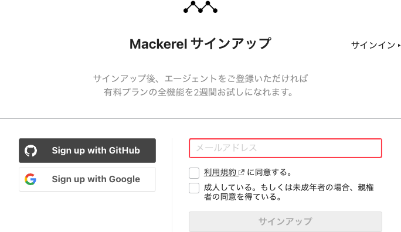
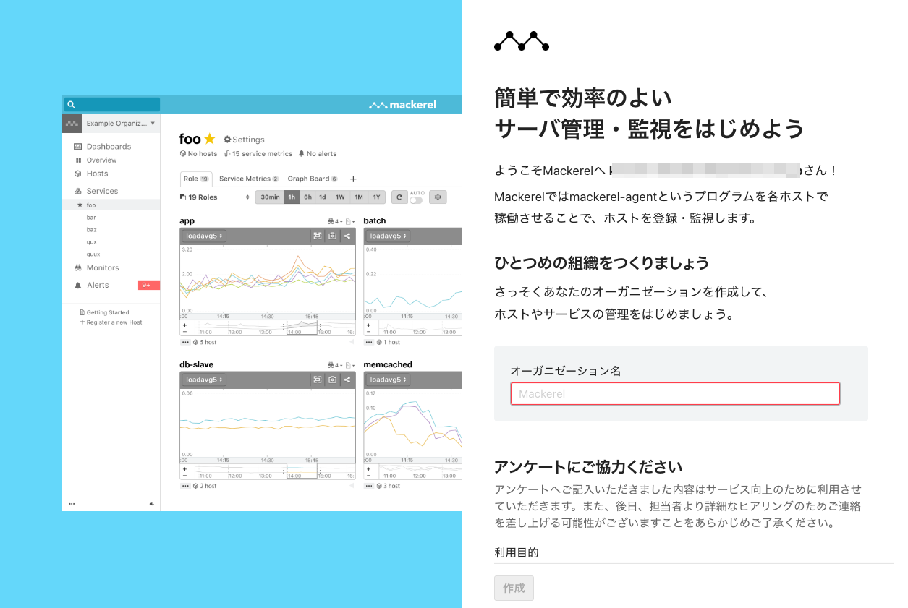
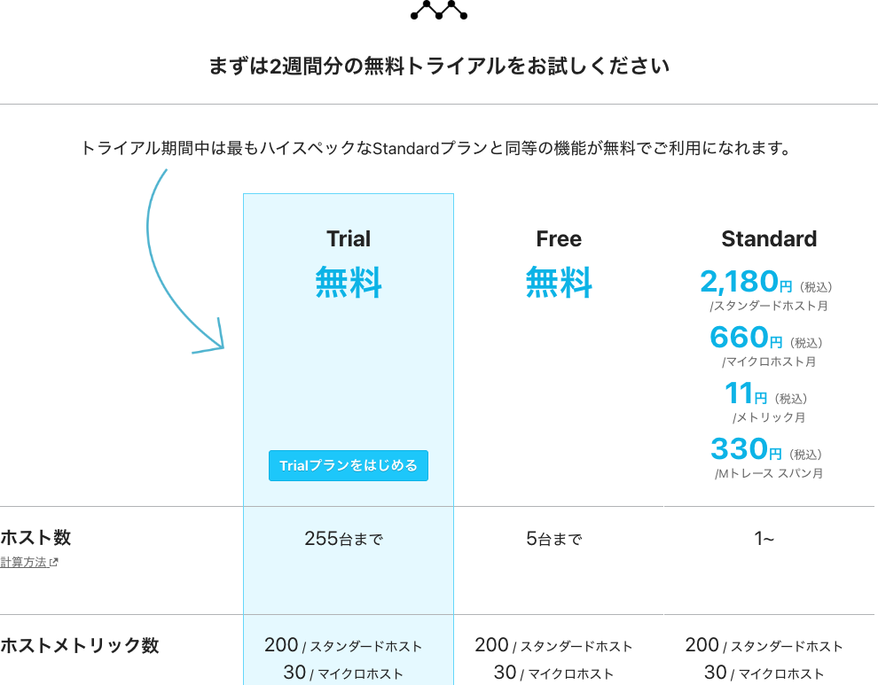
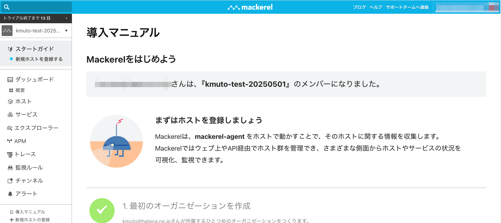
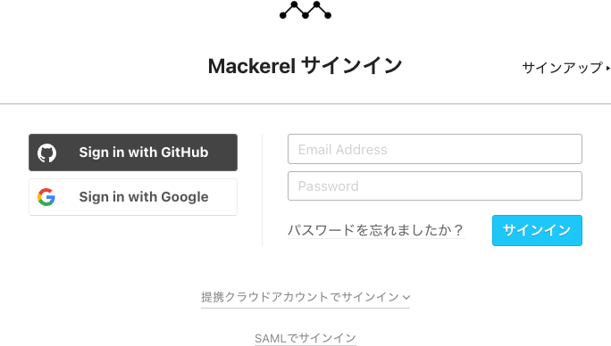
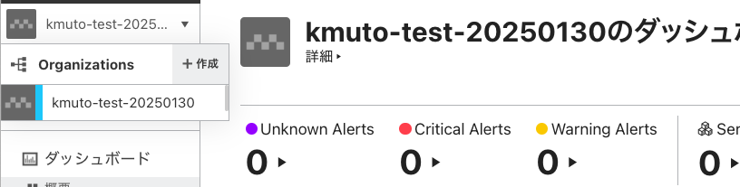

[←「このハンズオンを始める前の準備」へ戻る](../01-prepare/README.md)

[⇥準備をスキップして「分散トレーシングとは」へ進む](../03-distributedtracing/README.md)

# Mackerelを使うための準備

このハンズオンでは、分散トレーシングを体験いただくために、私たちのSaaS型オブザーバビリティプラットフォーム「[Mackerel](https://ja.mackerel.io)」を利用します。

そのため、Mackerelへユーザー登録するサインアップ、または既存のユーザー情報を使ったサインインと、分散トレーシングの投稿先となるオーガニゼーションの作成が必要です。既存のオーガニゼーションをお持ちであれば、それを利用しても構いません。

- Mackerelにユーザー登録することでの課金は一切発生しません
- 皆さんのメールアドレスがそのままユーザー名となります。お使いのコンピュータでメール内容を参照できるメールアドレスをご用意ください

> [!NOTE]
> 既存の有償契約オーガニゼーションでこのハンズオンを進める場合、別途トレースやAPMの機能を利用していると、1ヶ月あたりの無償枠を超過して課金が発生する可能性があります。懸念があるときには、後述するようにTrialプランで新しいオーガニゼーションを作成してください。

## Mackerelへのサインアップ

はじめてMackerelをご利用の場合は、[Mackerelサインアップ](https://mackerel.io/signup)から、アカウントの作成（サインアップ）を行ってください。

メールアドレス欄に有効なメールアドレスを記入し、「利用規約に同意する。」と「成人している。もしくは未成年者の場合、親権者の同意を得ている。」の2つを確認の上でチェックボックスをクリックして、「サインアップ」をクリックします。

次に、オーガニゼーションを作成します。

> [!NOTE]
> オーガニゼーションは「組織」を表す概念で、Mackerelの契約の単位となります。ユーザーアカウントは、1つ以上のオーガニゼーションに所属でき、付与された権限に応じて、オーガニゼーションの閲覧、更新などを行うことができます。

オーガニゼーション名を指定します。オーガニゼーション名には、3文字以上63文字以下の英数字およびハイフンを利用できます。

> [!NOTE]
> オーガニゼーションの名前はMackerel全体で一意である必要があります。自社名やサービス名などでの取得にはご注意ください。

さらにアンケートとしてお名前、個人・法人のどちらの利用か、想定利用台数、法人の場合は会社名・業種・従業員数・役割やご連絡先電話番号などの質問も提示されます。差し支えない範囲で記入し、「作成」ボタンをクリックして先に進んでください。

> [!NOTE]
> これはあくまでもアンケートで、個人・法人でプランや機能に違いが発生することはありません。

次にプランの選択画面が表示されます。新しく作成するオーガニゼーションには、2週間のトライアル期間が設定されており、Mackerelのすべての機能を期間中無料で利用できます。「Trialプランをはじめる」をクリックしてください。**トライアルではクレジットカード等を登録する必要なく、期間終了後はFreeプランに切り替わりますので、終了後に突然課金されるような心配はありません。**

これで、作成したオーガニゼーションが開きます。

この状態では、ユーザー登録がまだ完了していません。登録したメールアドレス宛てに「`[Mackerel] Please verify your email`」という件名のメールが届くので、メール本文に記載されているURLを開いて、パスワードの登録を完了しておいてください。

> [!IMPORTANT]
> Mackerelへのサインアップおよびオーガニゼーションの作成ができましたか？

> [!IMPORTANT]
> Mackerelユーザーのパスワードの設定は済みましたか？

**オーガニゼーションの用意ができたら、ハンズオンに臨む準備は完了です！** よろしければぜひMackerelのいろいろな機能を試してみてください。

## すでにMackerelのユーザーアカウントをお持ちの場合

すでにMackerelのユーザーアカウントをお持ちであれば、[Mackerelサインイン](https://mackerel.io/signin)から、メールアドレスとパスワードを使ってサインインできます。

既存のオーガニゼーションをこのハンズオンに利用することもできますし、画面左上にあるオーガニゼーション切り替えメニューの▼ボタンから「＋作成」をクリックして、新しいオーガニゼーションを作ることもできます。

> [!NOTE]
> 既存のオーガニゼーションをこのハンズオンに利用する場合、そのオーガニゼーションのオーナーまたは管理者の権限を持っている必要があります。権限を保有していない場合は、新しいオーガニゼーションを作成すれば、そのオーガニゼーションのオーナーになることができます。

> [!NOTE]
> 新しく作成したオーガニゼーションは、Trialプランから始められます。

Mackerelの分散トレーシング機能は、プランによって無料枠上限および課金有無が異なります。

|プラン|無料枠（M＝Million：100万）|無料枠を超えた場合|
|----|----|----|
|Trial|100Mスパン|その月の投稿ができなくなる|
|Free|5Mスパン|その月の投稿ができなくなる|
|Standard|5Mスパン|1Mスパン（切り上げ）あたり330円（税込）|

使用量は、トレースを構成するスパンの数に基づきます。トレースおよびスパンについては後述しますが、1M＝100万スパンを基準に据えているとおり、大量に消費しがちです。ただ、新規にオーガニゼーションを作成したときに適用されるTrialプランであれば100M＝1億スパンまで無料枠ですし、5M＝500万スパンのFreeプランでもこのハンズオンをひととおり済ませるくらいには十分に余裕があります。

> [!IMPORTANT]
> サインインできていて、オーナーまたは管理者権限のあるオーガニゼーションを用意できましたか？

では、ハンズオンを始めましょう！

[→「分散トレーシングとは」へ進む](../03-distributedtracing/README.md)
