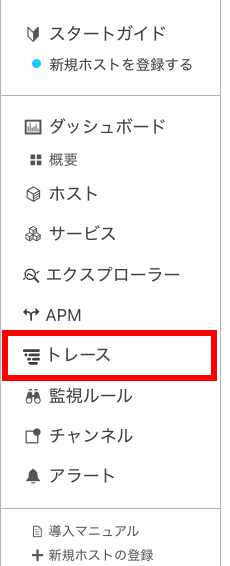
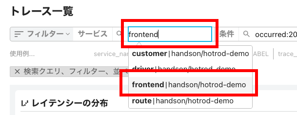
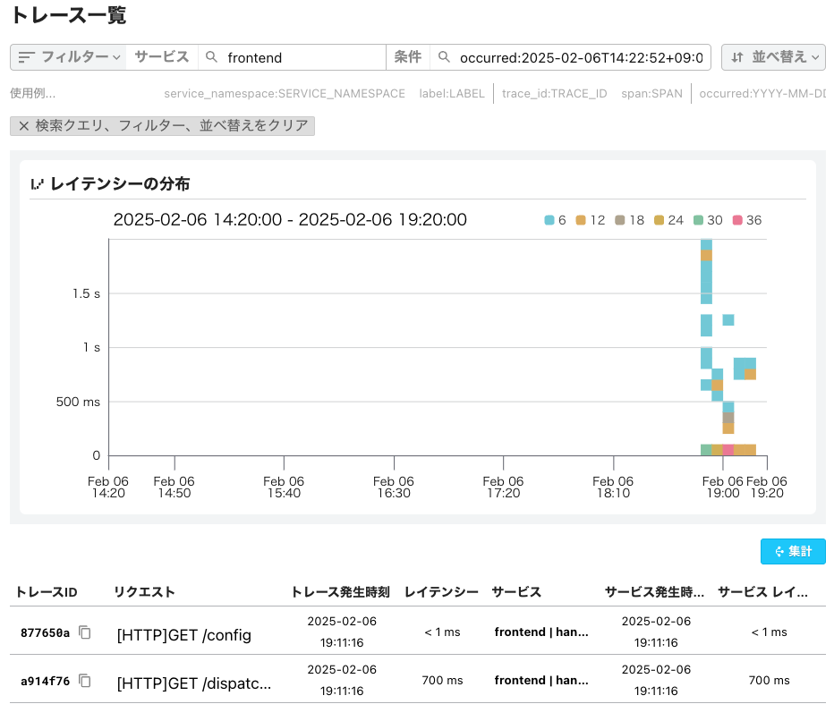
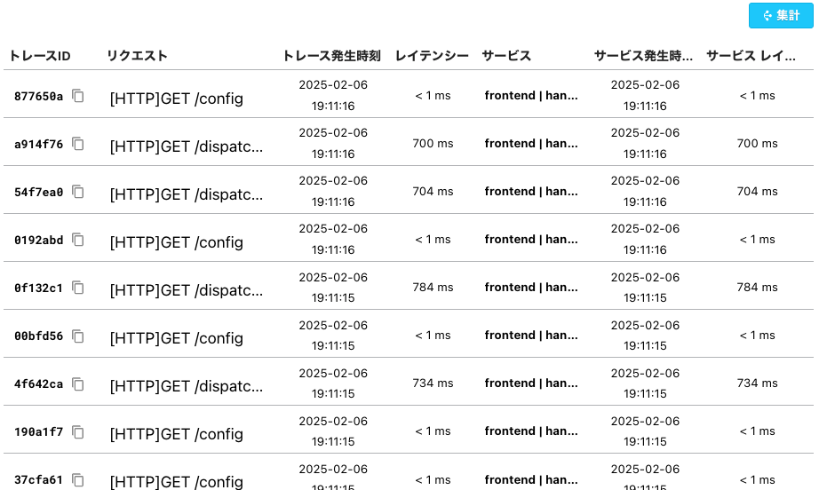
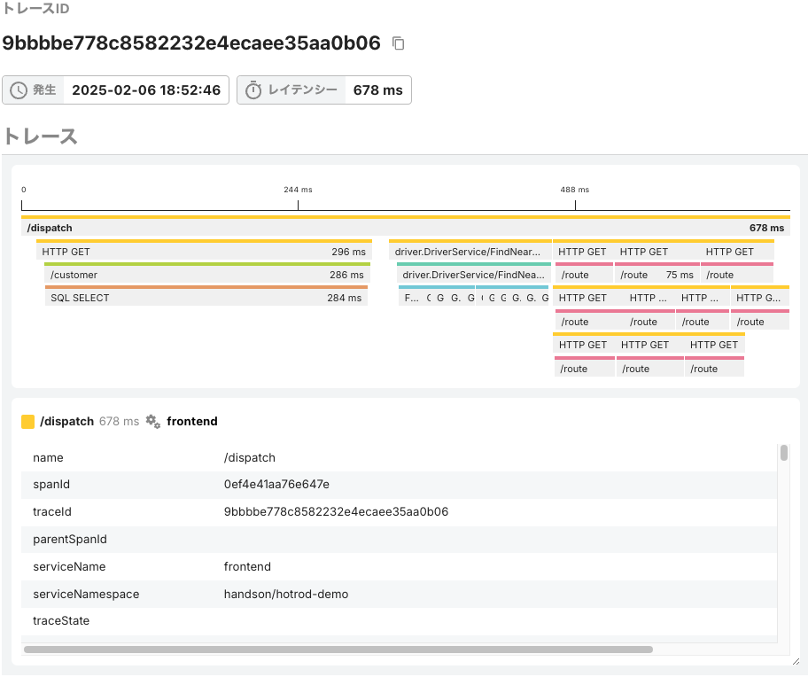
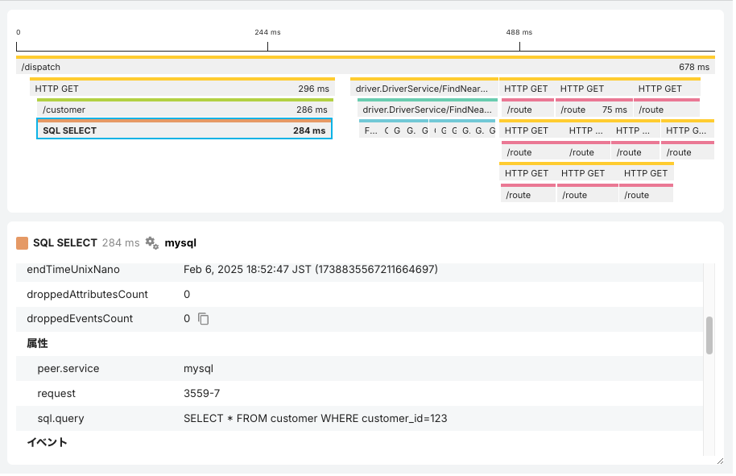

[←「HotRODデモを使ってトレースシグナルを送ってみよう 〜デモ環境をDockerで構築する」へ戻る](../05-hotrod1/README.md)

# HotRODデモを使ってトレースシグナルを送ってみよう 〜送信したトレースをMackerelで見る

先ほどHotRODアプリケーションから送ったトレースシグナルを、Mackerelで見てみましょう！

## Mackerelのトレース画面を見る

Mackerelのオーガニゼーション画面（[https://mackerel.io/my/](https://mackerel.io/my/)。異なる場合はサイドメニューからオーガニゼーションを選んでください）を開きます。

サイドメニューに「トレース」というメニューがあるので、これをクリックしてください。

これで、トレーシング機能の画面に移ります。「**トレース一覧**」という画面が最初に表示されます。

いくつかサイドメニューに機能メニューがありますが、前半のハンズオンでは「課題」、「トレース」（今見ているもの）を使っていきます。

> [!NOTE]
> 「データベース」では、データベースクエリに関連する情報を参照できます。詳細はハンズオンの後半のパートでご紹介します。

> [!NOTE]
> Mackerelのトレーシング機能はAPM（アプリケーションパフォーマンスモニタリング）として活用できるよう改良が続けられており、ここで挙げているキャプチャ表示とは異なる可能性があります。

> [!NOTE]
> ハンズオンで使わないメニューについてここで簡単に述べておくと、「ダッシュボード」はサービスSLOの表示、「サービス」はそのためのサービス構成、「設定」はスパン数の利用状況とアクセス可能なユーザー表示、およびSlackの連携設定があります。これらのメニューは、削除を含めて今後特に大きく変わる可能性が高いです。

この「トレース一覧」画面では、アプリケーション内の**サービス**ごとに、送信されたトレースを参照できます。

上部の「サービス」の空欄をクリックしてください。トレースが正常に送信されていれば、「`customer | handson/hotrod-demo`」「`driver | handson/hotrod-demo`」のように、サービスの一覧が示されます。

HotRODのフロントエンドサービスである「`frontend | handson/hotrod-demo`」を選んでクリックしてください。

> [!IMPORTANT]
> サービスの一覧は表示されましたか？

> [!NOTE]
> `frontend | handson/hotrod-demo` などが出てこない場合、トレースシグナルがMackerelに送られていない可能性があります。Dockerを起動したターミナルに何か情報がないか確認してください。DockerのOpenTelemetry Collectorの起動に失敗している（すでに別に動いているものがあったなど）、ファイアウォールでコンピュータから外部への通信を許可していない、`env.txt`に記述した送信先オーガニゼーションのAPIキーを誤っていてMackerelから拒否されているなど、いくつかの原因が考えられます。

> [!NOTE]
> frontendサービスは、HotRODのフロントエンドとして最初にブラウザからのアクセスを受け付け、ブラウザにレスポンスを返す役割を担います。ここからほかの各サービスが呼び出される様子を見られるので、このハンズオンでトレースを観察するには最適です。

> [!NOTE]
> `frontend | handson/hotrod-demo`の`frontend`はサービス名ですが、`handson/hotrod-demo`はサービスネームスペース（サービス名前空間）というものです。サービスネームスペースは、複数のアプリケーションからのシグナルを受け付けるオブザーバビリティプラットフォーム上でアプリケーションを区別できるようにするための補助的な属性で、送信側（このハンズオンのHotRODデモではOpenTelemetry Collector）で設定しています（[otel-col-demo.yml](../../demo/hotrod/otel-col-demo.yml)の`resource/namespace`を参照）。

これで、frontendサービスのトレースが画面上に**レイテンシーの分布**として表示されます。

横軸が時間推移（右にいくほど新しい）、縦軸がレイテンシー（上にいくほど時間がかかっている）です。トレースはヒートマップ表示になっており、凡例が右上にあるように、その時間帯・レイテンシーに存在する**トレースの総数**が色で示されます。

また、下部には表示範囲での**トレースの一覧**が列挙されています。

> [!NOTE]
>下部のトレース一覧には出ているにもかかわらず、レイテンシーの分布には出ていない場合、表示している時間範囲の時刻がトレースの送信時刻と近いために見切れてしまっている可能性があります。「条件」の欄にある範囲の時刻を調整（たとえば終了時刻を未来の時刻にするなど）してみてください。

トレースの一覧では、以下の情報が示されています。

- トレースID
- リクエストメソッド（`GET`や`POST`など）
- リクエストパス（`/dispatch`など）
- トレースの発生時刻とそのレイテンシー
- サービス名
- サービスのみで見たときの発生時刻とそのレイテンシー（frontendサービスの場合はトレースと同一）

そのほか、次のようなボタンがあります。

- 「フィルター」：最後に発生してからの時刻を設定したり、より詳細な条件を設定できます。
- 「並び替え」：トレース一覧を、発生順（新しい順・古い順）、あるいはレイテンシー（高い順・低い順）に基づいて並び換えます。
- 「集計」：トレース一覧のスパンの属性について、その値のバラつきを表示します。たとえば`http.route`属性はリクエストパス、`http.status_code`属性はレスポンスのステータスコードを示しますが、どのようなリクエストパスが多いのかや、レスポンスのエラー率などを見てとることができます。

レイテンシーの分布のエリアでは、ドラッグして範囲指定することで、その範囲についてドリルダウンして調べることもできます。

> [!IMPORTANT]
> レイテンシーの分布やトレース一覧は表示されましたか？

## トレースの詳細を見る

HotRODでボタンをクリックしたときには、`/dispatch`というリクエストパスが実行されています。このトレースを見てみましょう。

[最初にお話しした](../03-distributedtracing/README.md)**トレース**と**スパン**の関係を思い出してください。frontendサービスでの`/dispatch`リクエストパスのトレースには、いろいろなスパンが並んでいます。

- `/dispatch`（frontendサービス）：フロントエンドの処理
- `HTTP GET`（frontendサービス）：ほかのサービスへのHTTPでのリクエスト（顧客検索やルート検索）
- `/customer`（customerサービス）：顧客検索
- `SQL SELECT`（MySQLのダミー）：顧客検索のデータベースクエリ
- `driver.DriverService/FindNearest`（frontendサービス）：ドライバー検索のリクエスト
- `driver.DriverService/FindNearest`（driverサービス）：ドライバー検索実体
- `FindDriverIDs`（Redisのダミー）：ドライバー検索。10車両を探す
- `/route`（routeサービス）：ルート検索。得られた10車両について距離から到着時間を返す

スパンはサービスごとに色分けされ、同じサービスは同じ色で表示されます。

> [!NOTE]
> あくまでも1つのトレース内での色分けであり、別のトレースとの間でサービスが同じ配色になることは保証されません。

「スパンには各種の情報が**属性**と**値**として格納されています」と前に述べましたが、この画面でスパンをクリックすると、その属性と値を調べられます。どんなものが入っているか、いろいろなスパンについて見てみてください！

> [!IMPORTANT]
> `/dispatch`トレースがスパンで構成されている表示になって、スパンをクリックして属性と値を見ることができましたか？

[→「HotRODデモを使ってトレースシグナルを送ってみよう 〜レイテンシー悪化の原因を調査する」へ進む](../07-hotrod3/README.md)
