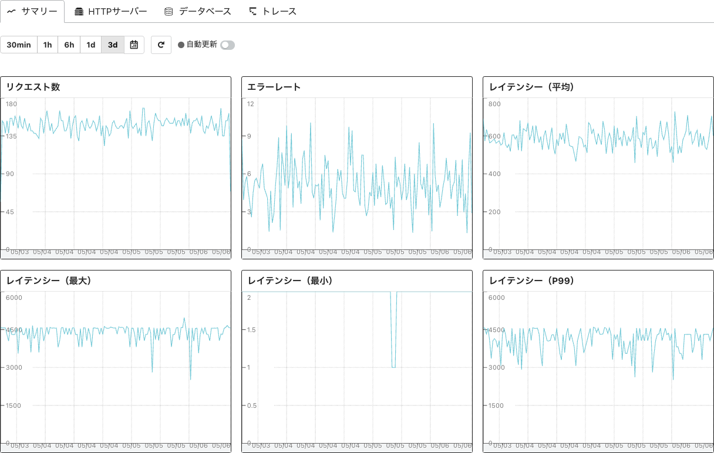
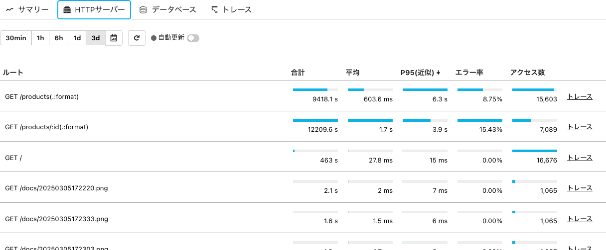
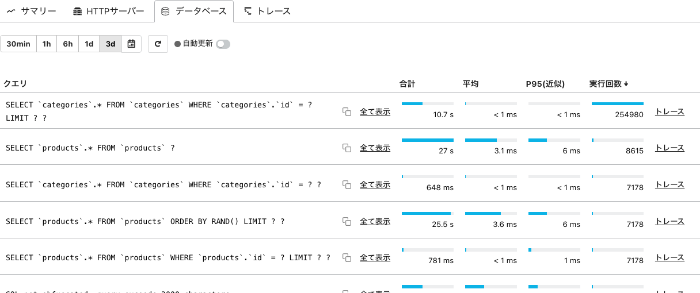

[←「HotRODデモを使ってトレースシグナルを送ってみよう 〜エラーの原因の解析」へ戻る](../09-hotrod5/README.md)

# ここまでのまとめ

実際のアプリケーションではこれほどあからさまではありませんが、いずれも**コードを隅々まで探し回る必要なし**に、分散トレーシングで問題の原因に近づくことができました。

- トレースを比較して、クエリの時間が伸びていることがレイテンシー悪化の理由であり、その原因は不要なロックにあることを突き止められました
- トレースから投資対効果の高い箇所を素早く見つけ出し、改善もビジュアライズして確証が持てました
- アプリケーションサービス内でエラーが発生したときに、発生箇所がすでに特定されており、状況を再現するのに十分な情報も得られることがわかりました

> [!NOTE]
> 2つめの例は、ハンズオンの時間によっては飛ばして挑戦課題としています。

どの例においても、最短ルートでたどり着けたことを実感いただけたでしょうか？

繰り返しになりますが、アプリケーションやシステムで何が起きているのかの情報をトレースとして記録し、分散トレーシング機能で見ることで、経験と勘に頼らずとも、原因を素早く推測できます。

多くの情報シグナルをMackerelのようなオブザーバビリティプラットフォームに送り、**オブザーバビリティ（可観測性）が高い状態となれば、これまでに経験がないという症状であっても恐れずに立ち向かうことができます**。

> [!NOTE]
> Dockerコンテナを終了するには、`docker compose up`を実行していたターミナルでCtrlキーを押しながらCキーを押して停止したあと、`docker compose down`を実行してください。Ctrl＋Cで停止しただけではまだコンテナが残っているため、`docker compose down`で消去します。

> [!IMPORTANT]
> 分散トレーシングの便利さを実感いただけましたか？

## 補足：トレースからAPMへ

分散トレーシングはそれ自体でも十分に便利ですが、「スパン1つひとつは小さなログデータ」とお話ししたとおり、トレースのスパンに含まれる情報を活用することで、アプリケーションの様子をより子細に可視化し、分析できます。

Mackerelの **APM（アプリケーションパフォーマンスモニタリング）** は、そのような可視化・分析のための機能です。傾向を見ながら重大なパフォーマンス上の問題をドリルダウンし、解決につなげることができます。現時点で、Mackerelの「APM」メニューから以下のようなアプリケーション解析が可能です。

- アプリケーションの健全性を測る代表的な方法としてRED（Request・Error・Duration）メソッドというものがあります。その指標となるリクエスト数・エラーレート・レイテンシーを、トレース情報をもとにグラフ表示します
- HTTPサーバーで受け付けたリクエストに関するトレース情報を使い、リクエストパスとその統計情報（合計・平均・95パーセンタイル・エラー率・アクセス数）を調べられます
- データベースへ発行したクエリに関するトレース情報を使い、クエリ文字列とその統計情報（合計・平均・95パーセンタイル・実行回数）を調べられます

このハンズオンは分散トレーシングについて説明してきましたが、これはAPMを利用するための必須の前提知識でもあるのです。

[→「トレースを用いてWebアプリケーションを改善してみよう」へ進む](../11-handson-intro/README.md)
