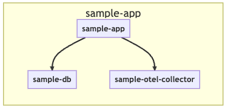
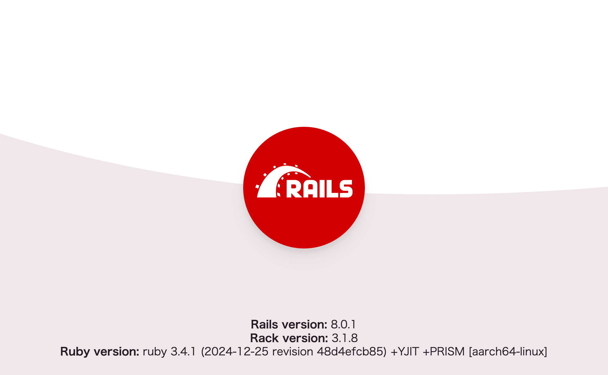

# トレースを用いてWebアプリケーションを改善してみよう 〜サンプルWebアプリケーションの準備

## 構成



以下の3つのコンテナが、コンテナ環境で立ち上がります。

- sample-app: Ruby on Railsで書かれたWebアプリケーション
- sample-db: データ保存先のPostgreSQL
- sample-otel-collector: OpenTelemetry Collector

HotRODの例と同様に、アプリケーションで計装されたトレースはOpenTelemetry Collectorで受信され、Mackerelに送信されます。

## 実行環境

アプリケーションは、先のハンズオンと同様にDocker上で実行します。まずはターミナル上で[`demo-sample-app/ruby`](../../demo-sample-app/)フォルダに移動しましょう。

```shell
cd demo-sample-app/ruby
```

## APIキーの設定

先ほどと同様に、MackerelのWebコンソールからAPIキーを取得し、[`env.txt`](../../demo-sample-app/ruby/env.txt)ファイルを書き換えてください。

> [!IMPORTANT]
> 詳しくは[MackerelのAPIキーの取得とenv.txtファイルの変更](../05-hotrod1/README.md#mackerelのapiキーの取得とenvtxtファイルの変更)を参照してください。先ほどと同じファイル名ですが、ディレクトリが異なることにご注意ください。

## アプリケーションのビルドとデータベースの初期化

アプリケーションを起動する前に、ビルドとデータベースの初期化を行います。ターミナルから以下のコマンドを実行し、データベースの初期化と初期データの登録をしてください。なお、アプリケーション用コンテナのビルドも同時に行われます。**この処理にはしばらく時間がかかります**。

```shell
docker compose run --rm app bin/rails db:prepare
```

コマンドの実行に成功すると、以下のようにコンテナのビルドとデータの登録が行われます。

```shell
05:13 ❯ docker compose run --rm app bin/rails db:prepare
[+] Running 19/19
 ✔ otel-collector Pulled                                                         7.8s
   ✔ 32e897be644b Pull complete                                                  1.2s
   ✔ 9ef1b8b02f2f Pull complete                                                  3.7s
   ✔ b4920bb24330 Pull complete                                                  3.7s
 ✔ db Pulled                                                                    12.8s
   ✔ 4d2547c08499 Already exists                                                 0.0s
   ✔ 3573814a3a24 Pull complete                                                  2.2s

(snip)

   ✔ 64efff9847b7 Pull complete                                                  8.7s
[+] Creating 3/3
 ✔ Network ruby_sample-app          Created                                      0.1s
 ✔ Container sample-otel-collector  Created                                      0.2s
 ✔ Container sample-db              Created                                      0.2s
[+] Running 2/2
 ✔ Container sample-otel-collector  Started                                      0.2s
 ✔ Container sample-db              Started                                      0.2s
[+] Building 2.2s (13/13) FINISHED                               docker:desktop-linux
 => [app internal] load build definition from Dockerfile                         0.0s
 => => transferring dockerfile: 266B                                             0.0s
 => [app internal] load metadata for docker.io/library/ruby:3.4.1-slim           1.8s

(snip)

 => => naming to docker.io/library/ruby-app                                      0.0s
 => [app] resolving provenance for metadata file                                 0.0s
Created database 'sample_development'
Created database 'sample_test'
```

> [!IMPORTANT]
> 以下の2行が表示され、処理が完了していれば初期化は成功です。
> ```shell
> Created database 'sample_development'
> Created database 'sample_test'
> ```

## アプリケーションの起動

準備が整ったので、Docker Composeでアプリケーションを動かしましょう。ターミナルで以下のコマンドを実行してください。

```
docker compose up
```

起動に成功すると、以下のように3つのコンテナが動作します。

```shell
$ docker compose up
[+] Running 3/3
 ✔ Container sample-db              Running                            0.0s
 ✔ Container sample-otel-collector  Running                            0.0s
 ✔ Container sample-app             Created                            0.1s
Attaching to sample-app, sample-db, sample-otel-collector
sample-app             | => Booting Puma
sample-app             | => Rails 8.0.1 application starting in development
sample-app             | => Run `bin/rails server --help` for more startup options
sample-app             | I, [2025-02-12T01:15:40.272611 #1]  INFO -- : Instrumentation: OpenTelemetry::Instrumentation::ActiveSupport was successfully installed with the following options {}

(snip)

sample-app             | I, [2025-02-12T01:15:40.282211 #1]  INFO -- : Instrumentation: OpenTelemetry::Instrumentation::Rails was successfully installed with the following options {}
sample-app             | Puma starting in single mode...
sample-app             | * Puma version: 6.6.0 ("Return to Forever")
sample-app             | * Ruby version: ruby 3.4.1 (2024-12-25 revision 48d4efcb85) +YJIT +PRISM [aarch64-linux]
sample-app             | *  Min threads: 3
sample-app             | *  Max threads: 3
sample-app             | *  Environment: development
sample-app             | *          PID: 1
sample-app             | * Listening on http://0.0.0.0:3000
sample-app             | Use Ctrl-C to stop
```

> [!NOTE]
> 起動に失敗する場合は、表示されるメッセージを確認してください。よくある原因として、ポートを占有しているコンテナまたはアプリケーションがすでに起動していることが考えられます。

ブラウザで[http://localhost:3000](http://localhost:3000)にアクセスすると、Ruby on Railsのデフォルトページが表示されるはずです。



これで準備が整いました。

[→「トレースを用いてWebアプリケーションを改善してみよう 〜OpenTelemetryによる計装」へ進む](../13-instrumentation/README.md)
