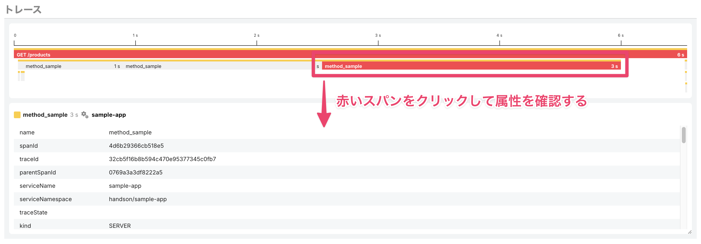
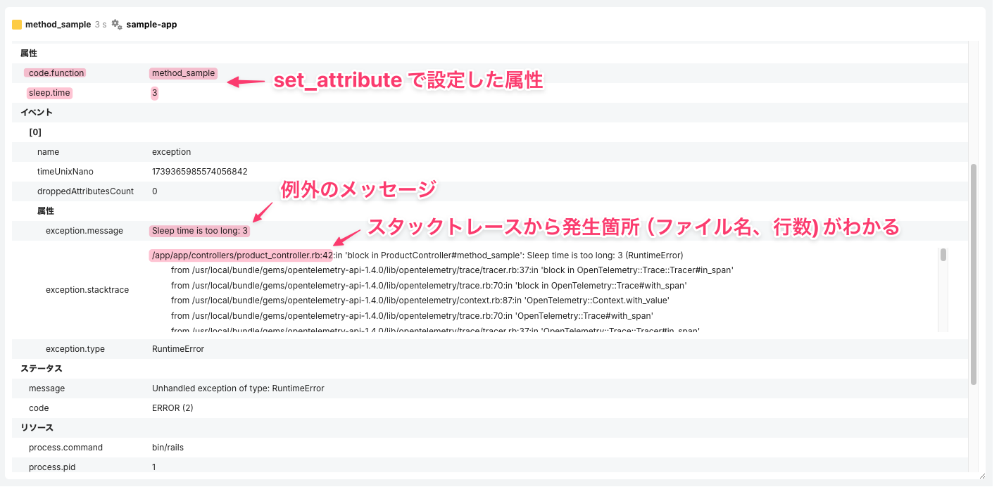
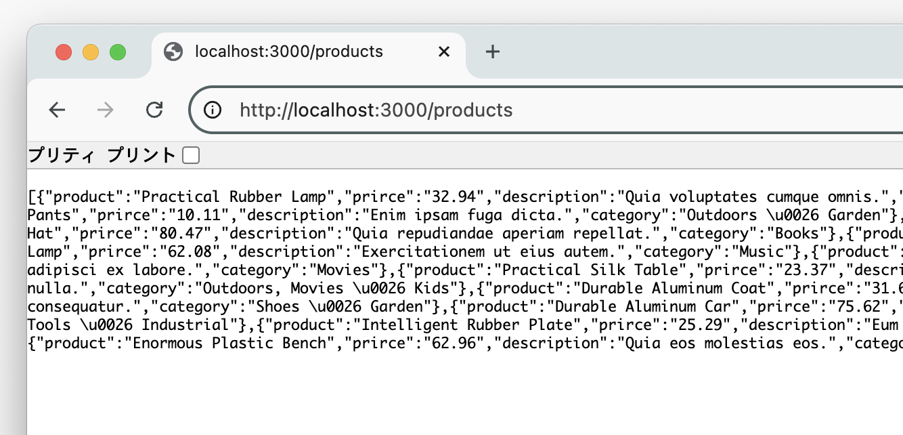

# トレースを用いてWebアプリケーションを改善してみよう 〜シナリオ1

アプリケーションで発生しているエラーを解消してみましょう。もう一度トレースの画面を確認し、赤く表示されているスパンに着目してみます。このスパンをクリックすると、そのスパンに設定されている属性やイベントの詳細が確認できます。



「イベント」の項目に`exception`という名前のイベントが記録されており、`exception.message`、`exception.stacktrace`、`exception.type`といった属性でエラーの詳細が確認できるはずです。



スタックトレースからエラーの行数を特定しアプリケーションを改善してみましょう。エディタで[`app/controllers/product_controller.rb`](../../demo/sample-app/ruby/app/controllers/product_controller.rb)を開いてください。

`method_sample`メソッドは以下のループで1, 2, 3を引数として3回呼び出されます。

```ruby
(1..3).each do |n|
  method_sample(n)
end
```

次に、先ほどのスタックトレースに含まれていたエラーが起きている行を確認します。該当箇所を見ると引数の`n`が2より大きい時に例外が起きるようになっているため、これを5より大きい時に例外が起きるようにif文を修正し保存します。

修正前: ループ内でnは3となり、2より大きいため例外発生

```ruby
if n > 2
  raise "Sleep time is too long: #{n}"
end
```

修正後: 閾値を5にすることで例外が起きなくなる

```ruby
if n > 5
  raise "Sleep time is too long: #{n}"
end
```

コードが修正できたら再び[http://localhost:3000/products](http://localhost:3000/products)にアクセスしてみましょう。エラーの原因を取り除いたのでエラーの表示は出なくなり、代わりにJSONデータが表示されます。



> [!NOTE]
> Rubyのコードを修正した場合はdockerコンテナを立ち上げ直す必要はありません

トレースの一覧に戻り再度sample-appで検索し、コード修正後のトレースも確認してみましょう。エラーが解消されたため、このようにスパンのエラー表示が解消されているはずです。


また、今回はトレースを起点にエラーの解消を行いましたが、HotRODのハンズオンでも見たようにエラーの一覧から問題を解決するというアプローチもとることができます。

[→「トレースを用いてWebアプリケーションを改善してみよう 〜シナリオ2」へ進む](../16-scenario2/README.md)
